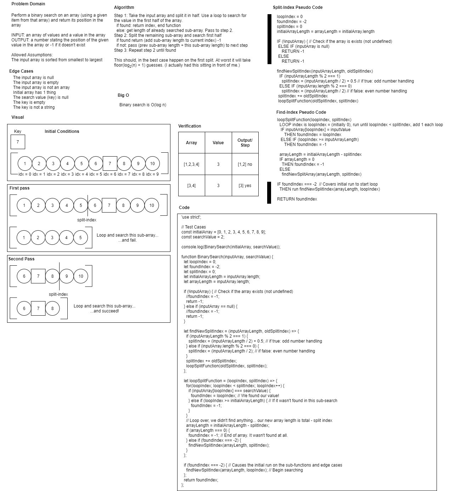

# Shift an Array

Take a array and a value. Using a binary search algorithm find the value in the array.

## Challenge

We need a function that (without using the built-in methods):
Input: Takes in an array and a search value.
Output: Find the value in the array by splitting the array and searching half. If not found, split the array again and keep splitting ans searching until the search value is found.

Edge cases:
 - The input array is null
 - The input array is empty
 - The input array is not an array
 - Initial array has 1 thing
 - The search value (key) is null
 - The key is empty
 - The key is not a string

## Approach & Efficiency

First we test for edge cases, especially a bad array.
Then we find the place to split the array and use a loop to compare the search value at the loop index of the input array. This splitting and searching continues until the array being split has a length of 0 (meaning it wasn't found). All failure cases report a -1, otherwise the index value of the search value is returned.
Big O is assumed to be O(log n) since it is a binary search.

## Solution

