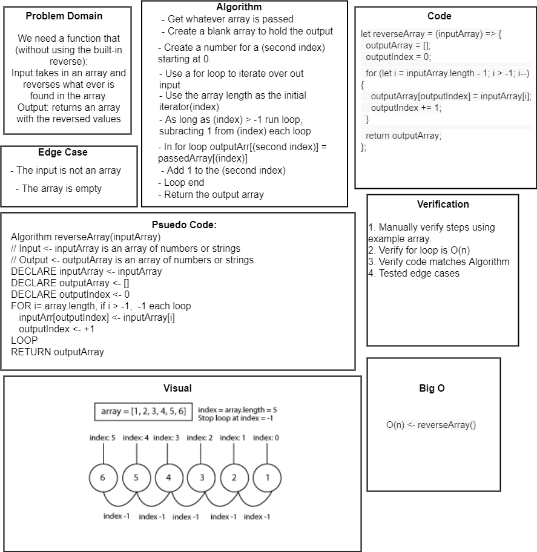

# Reverse an Array

Take an array of strings or numbers and reverse the contents.

## Challenge

We need a function that (without using the built-in reverse):
Input: Takes in an array and reverses whatever is found in the array
Output: Returns an array with the reversed values

Edge cases:
 - The input is not an array
 - The array is empty (which is the same in reverse anyway)  

## Approach & Efficiency

Find the size of the inputArray and use that to negatively iterate over the array.
Store the values from the inputArray, working backward in a new array that is ultimately returned.
Big O is O(n) since there is a 1:1 relationship between our array input and output from the loop.

## Solution

