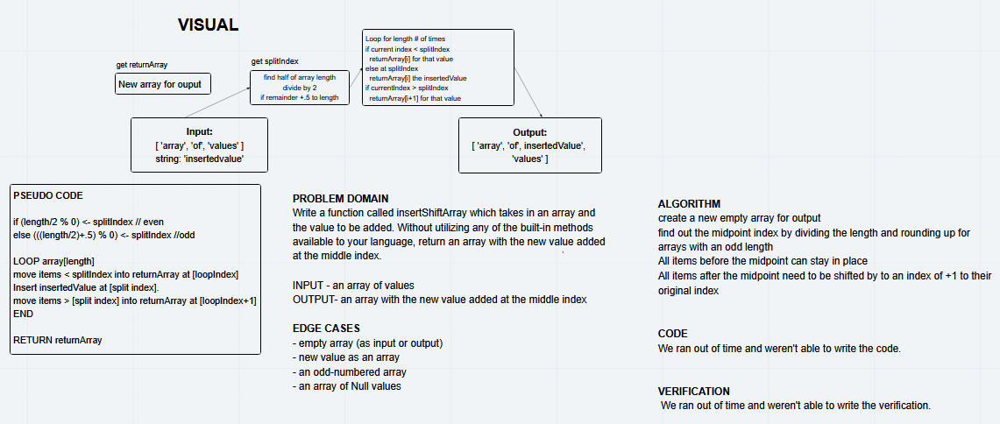

# Shift an Array

Take a array and a value. Insert the value into the middle of the array.

## Challenge

We need a function that (without using the built-in methods):
Input: Takes in an array and a value.
Output: Returns an array with the input value inserted into the middle of the input array.

Edge cases:
 - The input array is not a proper array
 - The array is empty (which means the middle will still be the same)  
 - The input string is not a string or is null

## Approach & Efficiency

Find the size of the inputArray and use that to put the first half of the input array into a new array.
Add the input string at the end of the array and then continue reading in the input array until done.
Big O is assumed to be O(n) since there is roughly a 1:1 relationship between our array input and output from the loop.

## Solution

