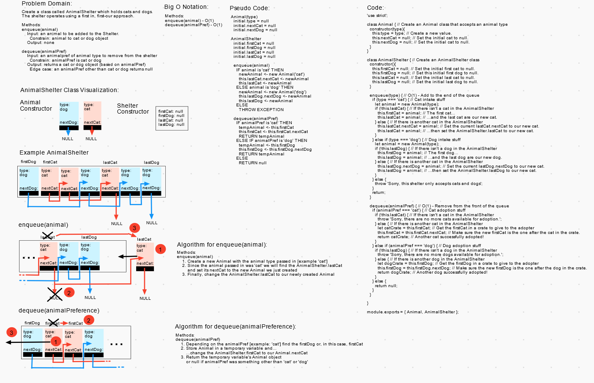

# Animal Shelter Queue

Create a class called `AnimalShelter` which holds only dogs and cats. The shelter operates using a first-in, first-out approach. This will require creating an `animal` class as well as the following methods on `AnimalShelter`.

## Challenge

**AnimalShelter should have these two different methods:**

>`.enqueue(animal)` (adds a 'cat' to the `lastCat` or a 'dog' to the `lastDog` of the queue)  
>Input: a `animal` object to add to the queue's `lastCat` or `lastDog` (as appropriate)  
>Output: none  

>`.dequeue(animalPref)` (remove the `animal` at the front of the queue by type of `animalPref` and return it)  
>Input: none  
>Output: the first `animal` of the node removed from the front of the queue  
>Edge Case(s):
>- Attempting to `dequeue(animalPref)` if the type of animalPref isn't in the shelter throws an exception  
>- Calling an `animalPref` other than 'dog' or 'cat' returns null

## Approach & Efficiency

I found that it was necessary to add an `lastCat` and `lastDog` property to the `AnimalShelter` class to maintain O(1) time performance.

### Big O Notation

- All methods on all classes are O(1) for time and space.

## Testing

Write tests to prove the following functionality:

- AnimalShelter
  - Can successfully instantiate an empty AnimalShelter
  - Can successfully instantiates an empty animal of each type
  - Can successfully enqueue an animal of each type into the AnimalShelter
  - Can successfully enqueue multiple animals of each type into the AnimalShelter
  - Calling enqueue on with an animal that isn't a cat or dog raises an exception
  - Can successfully dequeue each type of animal out of an AnimalShelter
  - Can successfully empty an AnimalShelter of an animal type after multiple dequeues, leaving the other type
  - Can successfully completely empty an AnimalShelter of all animals after multiple dequeues
  - Calling dequeue on AnimalShelter without any more cats/dogs raises exception
  - Calling dequeue with an animal type other than 'cat' or dog' raises exception

## Whiteboard(s)

_Whiteboard(s) may not contain the final coded solution and are time-boxed._

