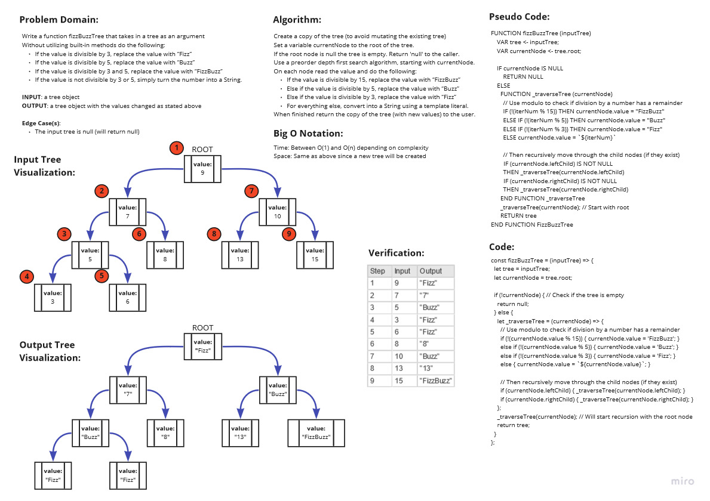

# Tree Data Structures - FizzBuzzTree

Write a function fizzBuzzTree that takes in a tree as an argument

Without utilizing built-in methods do the following:
- If the value is divisible by 3, replace the value with “Fizz”
- If the value is divisible by 5, replace the value with “Buzz”
- If the value is divisible by 3 and 5, replace the value with “FizzBuzz”
- If the value is not divisible by 3 or 5, simply turn the number into a String.

## Authors

Authors: Jeremy Penning  

## Challenge

**FizzBuzzTree should have this function:**

>`.fizzBuzzTree(tree)` (a `tree` - assumed to be a binary tree)  
>Input: a `tree` object  
>Output: a `tree` object with the transformations listed above

## Approach & Efficiency

### Big O Notation

- For this function it seems that the Big O time varies from O(1) to O(n) depending on the complexity of the tree. Big O space is directly proportional to the input tree, O(n of input tree) since a new tree is created to maintain immutability.

## Testing (Optional)

Write tests to prove the following functionality:
- Can return null on an empty tree input
- Can successfully transform a tree to a FizzBuzz tree

## Whiteboard(s) / UML

_Whiteboard(s) may not contain the final coded solution and are time-boxed._

