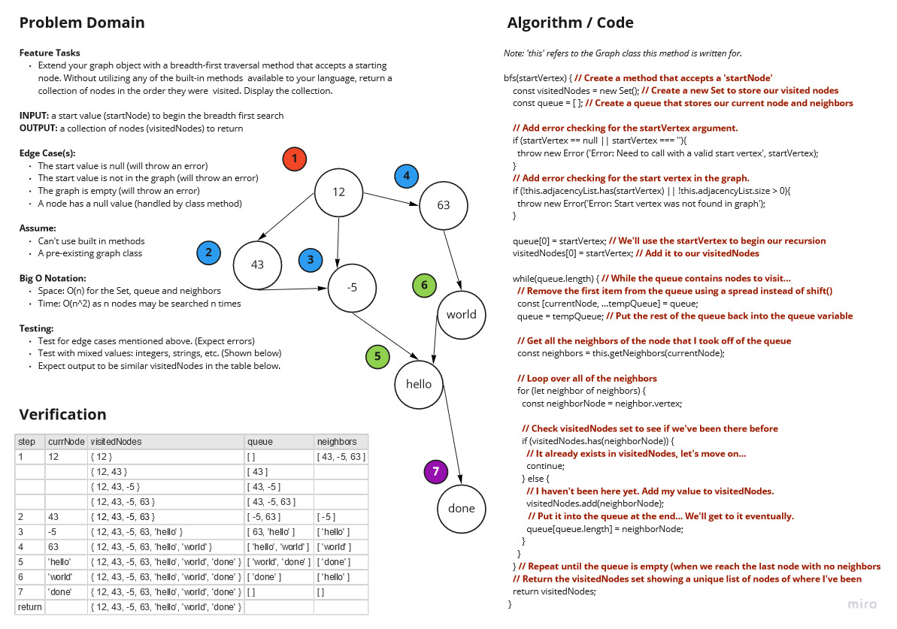

# Graph

Implement your own Graph, represented as an adjacency list.

The graph should include the following methods:

## Challenge

**Create the following functions:**

>`addVertex(value)` (add a vertex with `value` to the graph)  
>**Input:** a `value` for the vertex  
>**Output:** none  
>**Edge Case(s):**
>- Vertex already exists (throws error)

>`addDirectedEdge(startVertex, endVertex, weight)` (adds an edge (with `weight`) between two verticies)  
>**Input:** a `startVertex`, `endVertex` and a numeric `weight`  
>**Output:** none  
>**Edge Case(s):**  
>- Either vertex is not in the adjacency list (throws error)

>`getNeighbors(vertex)` (finds the neighboring verticies and weights of a `vertex`)  
>**Input:** a `vertex` used to find neighbors  
>**Output:** an object with neighboring verticies and edge weights  
>**Edge Case(s):**
>- The vertex is not in the adjacency list (throws error)

>`getNodes()` (return a list of nodes starting with the first added to the adjacency list)  
>**Input:** none  
>**Output:** an array of verticies starting with the first added to the adjacency list  
>**Edge Case(s):**
>- None

>`bfsSize(startVertex)` (returns the total number of nodes in the graph from `startVertex` using breadth first search)  
>**Input:** a `startVertex` to begin searching from  
>**Output:** the total number of nodes in the graph from `startVertex`  
>**Edge Case(s):**
>- The `startVertex` is null (throws error)
>- `startVertex` is not in the adjacency list (throws error)
>- The adjacency list is empty (throws error)

>`adjListSize()` (the total number of nodes in the graph according to the adjacency list)  
>**Input:** none  
>**Output:** returns the total number of nodes in the graph according to the adjacencyList.size  
>**Edge Case(s):**
>- None

>`propSize()` (the total number of nodes in the graph according to the graph's size property)  
>**Input:** none  
>**Output:** the total number of nodes in the graph according to the graph's size property  
>**Edge Case(s):**:
>- None

>`bfs(startVertex)` (breadth first search starting at `startVertex`)  
>**Input:** the `startVertex` to begin searching from  
>**Output:** a map of the graph, breadth first  
>**Edge Case(s):**
>- None, but should have handling to check for invalid `startVertex`

>`dfs(startVertex)` (depth first search starting at `startVertex`)  
>**Input:** the `startVertex` to begin searching from  
>**Output:** a map of the graph, depth first  
>**Edge Case(s):**
>- None, but should have handling to check for invalid `startVertex`

>`pathTo(startVertex, endVertex)` (a map showing the path between a `startVertex` and `endVertex`)  
>**Input:** a `startVertex` and `endVertex`  
>**Output:** a map showing the path between a `startVertex` and `endVertex`  
>**Edge Case(s):**
>- None, but should have handling to check for invalid `startVertex` and/or `endVertex`

## Approach & Efficiency

### Big O Notation

When adding a vertex or an edge time is O(1), space is O(all vertices + all edges). All search methods other than adjacency list lookups are assumed to be are O(n^2).

## Testing

Write tests to prove the following functionality:

- [X] An empty graph properly returns null
- [X] Adding an existing vertex throws an error
- [X] Calling getNeighbors on an empty graph throws an error
- [X] Calling addDirectedEdge with invalid verticies throws an error
- [X] Calling bfsSize with invalid vertex throws an error
- [X] Calling bfs on an empty graph throws an error
- [X] Calling dfs on an empty graph throws an error
- [X] A vertex can be successfully added to the graph
- [X] An edge can be successfully added to the graph
- [X] A collection of all nodes can be properly retrieved from the graph
- [X] All appropriate neighbors can be retrieved from the graph with the weight between nodes included
- [X] The proper size is returned (using bfsSize, adjListSize and propSize), representing the number of nodes in the graph
- [X] A graph with only one node and edge can be properly returned
- [X] Calling bfs (breadth first search) returns expected output
- [X] Calling dfs (depth first search) returns expected output
- [X] Calling pathTo to returns expected output

## Whiteboard / UML

