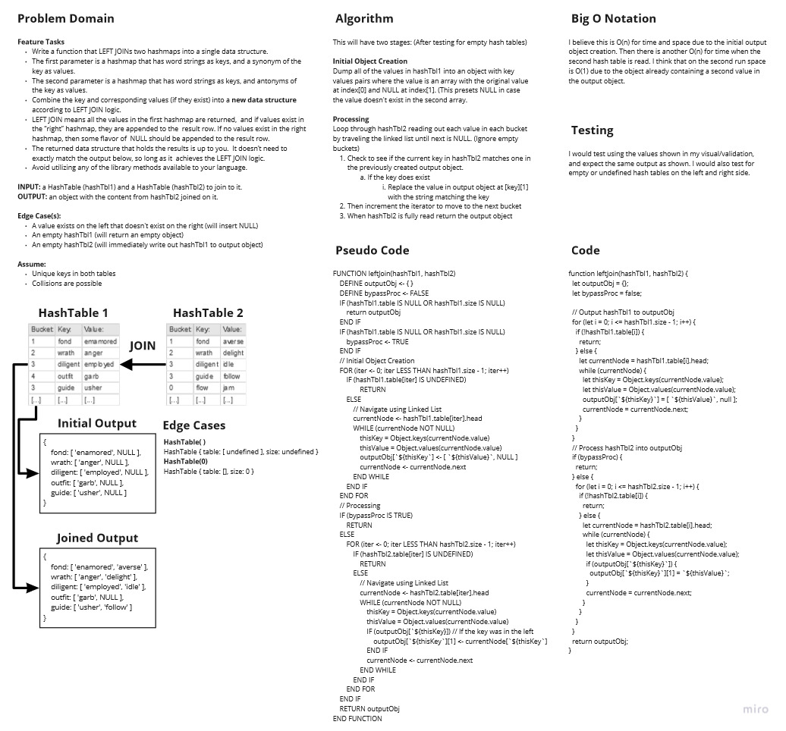

# Left Join Hash Tables

Write a function that LEFT JOINs two hashmaps into a single data structure.

The first parameter is a hashmap that has word strings as keys, and a synonym of the key as values.

The second parameter is a hashmap that has word strings as keys, and antonyms of the key as values.

Combine the key and corresponding values (if they exist) into a new data structure according to LEFT JOIN logic.

LEFT JOIN means all the values in the first hashmap are returned,  and if values exist in the “right” hashmap, they are appended to the  result row. If no values exist in the right hashmap, then some flavor of  NULL should be appended to the result row.

The returned data structure that holds the results is up to you.  It doesn’t need to exactly match the output below, so long as it  achieves the LEFT JOIN logic.

Avoid utilizing any of the library methods available to your language.

## Challenge

**Create a function leftJoin:**

>`leftJoin(hashTableLeft, hashTableRight)` (Joins `hashTableRight` on `hashTableLeft` and outputs an object showing the outcome)  
>Input: A hash table `hashTableLeft` and a hash table `hashTableRight` that will be joined if the values match the left.  
>Output: An `object` showing the outcome of the left join  
>Edge Case(s):  
>- A value exists on the left that doesn't exist on the right (will insert NULL)  
>- An empty hashTbl1 (will return an empty object)  
>- An empty hashTbl2 (will immediately write out hashTbl1 to output object)  

## Approach & Efficiency

### Big O Notation

I believe this is O(n) for time and space due to the initial output object creation. Then there is another O(n) for time when the second hash table is read. I think that on the second run space is O(1) due to the object already containing a second value in the output object.

## Testing

Write tests to prove the following functionality:

- [X] Successfully left joins the two hash tables
- [X] Skips processing if the right hash table is empty
- [X] Returns an empty object if the left table is empty
- [X] Skips processing if the right hash table is null
- [X] Returns an empty object if the left table is null.

## Whiteboard/UML

