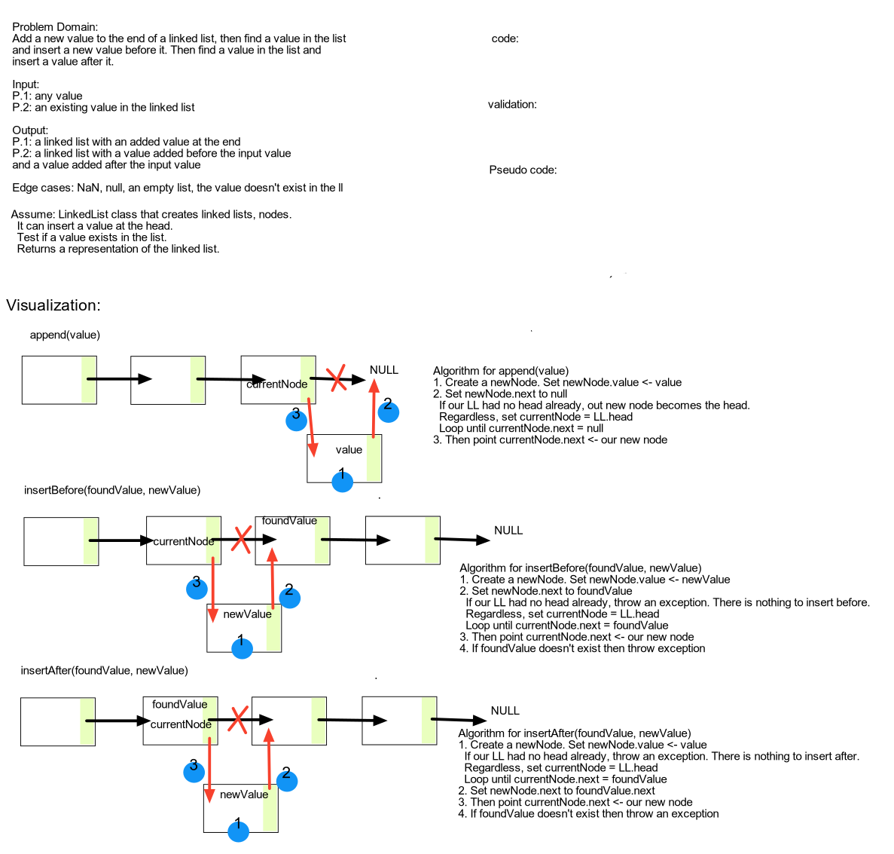

# Linked Lists

Extend your LinkedList class with:

- `.append(value)` which adds a new node with the given `value` to the end of the list
- `.insertBefore(value, newVal)` which add a new node with the given `newValue` immediately before the first `value` node
- `.insertAfter(value, newVal)` which add a new node with the given `newValue` immediately after the first `value` node

Any exceptions or errors that come from your code should be semantic, capturable errors. For example, rather than a default error thrown by your language, your code should raise/throw a custom, semantic error that describes what went wrong in calling the methods you wrote for this lab.

## Challenge

**Create a linked list with three different methods:**

>`.append(value)` (add a new node with `value` to the end of the LinkedList)
>Input: a string value
>Output: a node with the input value inserted at the `head`
>
>Edge Case(s):
>- If linked list is empty, the new head should have next = null

>`includes` (searches the list for a value)
>Input: a string value
>Output: a boolean representing whether the input value was found in the linked list
>
>Edge Case(s):
>- If linked list is empty, the method should return false

>`toString` (represent our linked list as a string of values).
>Input: none
>Output: a representation of the linked list as a string
>
>Edge cases:
>- The linked list is empty

## Approach & Efficiency

Big O is assumed to be O(1) for all three methods.

## Testing (Currently Incomplete)

Write tests to prove the following functionality:

- Can successfully instantiate an empty linked list
- Can properly insert into the linked list
- The head property will properly point to the first node in the linked list
- Can properly insert multiple nodes into the linked list
- Will return true when finding a value within the linked list that exists
- Will return false when searching for a value in the linked list that does not exist
- Can properly return a collection of all the values that exist in the linked list

## Solution

