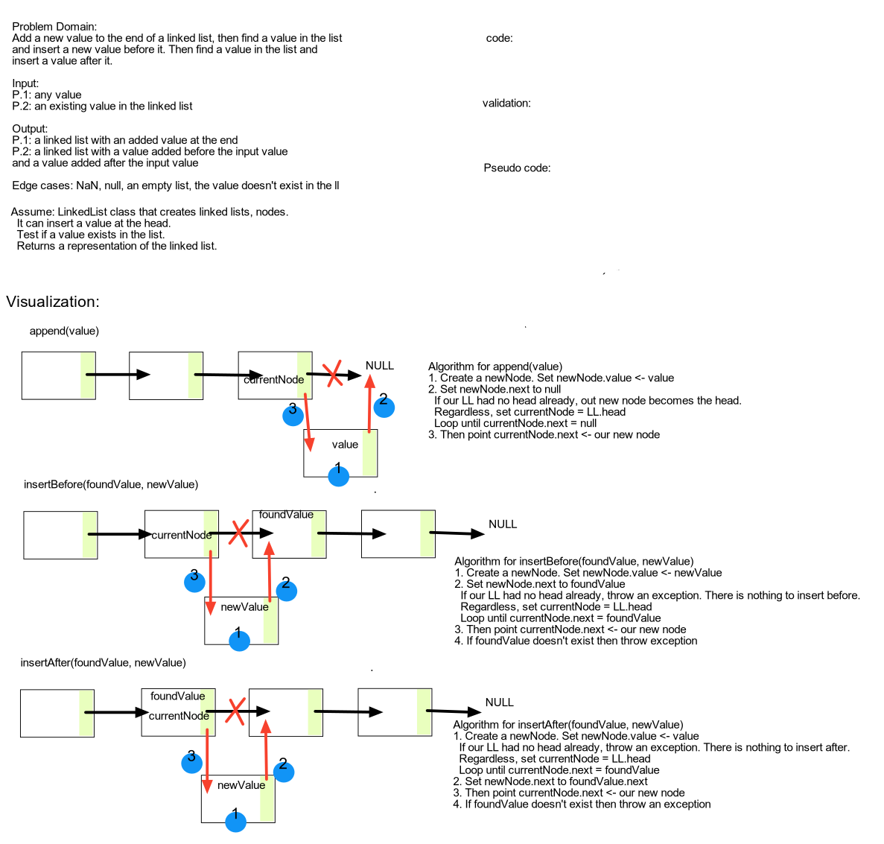

# Linked List Insertions

Write the methods below as extensions to the LinkedList class.

## Challenge

**Extend the linked list with these three different methods:**

>`.append(value)` (adds a new node with the given `value` to the end of the list)  
>Input: a string `value`  
>Output: a node with the `value` inserted at the end of the list  
>Edge Case(s):
>- If linked list is empty (head = null), the new node should be the head

>`.insertBefore(value, newVal)` (adds a new node with `newVal` immediately before the first node containing `value`)  
>Input: a `value` string to search for, a `newVal` string to insert in a new node before `value`  
>Output: a node with the `newVal` inserted before the searched `value`  
>Edge Case(s):
>- Attempting to insertBefore() the head node should divert to insert() instead.

>`.insertAfter(value, newVal)` (adds a new node with `newVal` immediately after the first node containing `value`)  
>Input: a `value` string to search for, a `newVal` string to insert in a new node after `value`  
>Output: a node with the `newVal` inserted after the searched `value`  
>Edge case(s):
>- Attempting to insertAfter() the tail node should divert to append() instead.

## Approach & Efficiency

### Big O Notation

- LinkedList.append() - O(n)
- LinkedList.insertBefore() - O(1) (plus time to search for value)
- LinkedList.insertAfter() - O(1) (plus time to search for value)

## Testing

Write tests to prove the following functionality:

- Can successfully add a node to the end of the linked list
- Can successfully add multiple nodes to the end of a linked list
- Can successfully insert a node before a node located i the middle of a linked list
- Can successfully insert a node before the first node of a linked list
- Can successfully insert after a node in the middle of the linked list
- Can successfully insert a node after the last node of the linked list

## Whiteboard Solution

