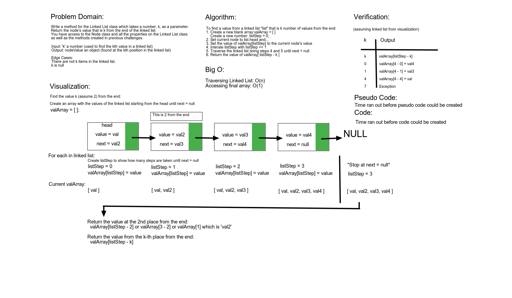

# Linked List Kth from End

Write a method for the Linked List class which takes a number, k, as a parameter. Return the node’s value that is k from the end of the linked list.

## Challenge

**Extend the linked list with these three different methods:**

>`.kthFromEnd(k)` (returns the node’s value that is `k` from the end of the linked list)  
>Input: a number `k` used as a search value
>Output: the value of the node `k` places from the end of the linked list  
>Edge case(s):
>- An empty linked list (Throw error)
>- `k` is greater than nodes in the linked list. (Throw error)
>- `k` is not a positive integer (Throw error)
>- `k` is '1' and linked list has only 1 node (Can handle)

## Approach & Efficiency

### Big O Notation

- LinkedList.kthFromEnd - O(n)

## Testing

Write tests to prove the following functionality:

- Where k is greater than the length of the linked list
- Where k and the length of the list are the same
- Where k is not a positive integer
- Where the linked list is of a size 1
- “Happy Path” where k is not at the end, but somewhere in the middle of the linked list

## Whiteboard Solution

