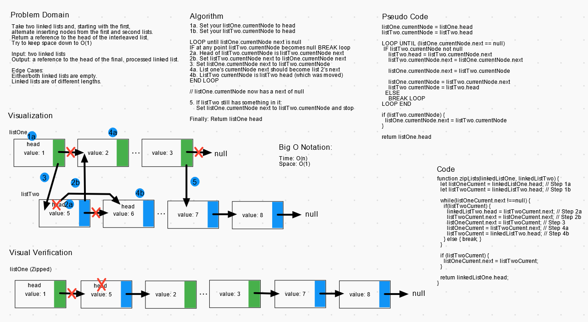

# Linked List Zip Lists

Write a function called `zipLists` which takes two linked lists as arguments. Zip the two linked lists together into one so that the nodes alternate between the two lists and return a reference to the head of the zipped list. Try to keep additional space down to O(1).

## Challenge

**Extend the linked list with this method:**

>`zipLists(linkedListOne, LinkedListTwo)` (interleaves `linkedListOne` and `linkedListTwo` to a single linked list)  
>Input: a linked list `linkedListOne` and a linked list `linkedListTwo`  
>Output: a reference to the head of the interleaved linked list  
>Edge case(s):
>- Either linked list is empty (Throw error)
>- `linkedListOne` is smaller than `linkedListTwo` (Passes)
>- `linkedListTwo` is smaller than `linkedListOne` (Passes)

## Approach & Efficiency

### Big O Notation

- LinkedList.zipLists - O(1)

## Testing

Write tests to prove the following functionality:

- Where either linked list is empty
- Where `linkedListOne` is smaller than `linkedListTwo`
- Where `linkedListTwo` is smaller than `linkedListOne`

## Whiteboard Solution

