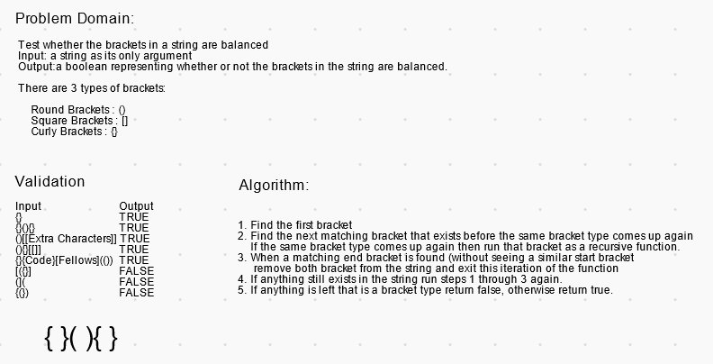

# Multi Bracket Validation

Test whether the brackets in a string are balanced
Input: a string as its only argument
Output:a boolean representing whether or not the brackets in the string are balanced.

There are 3 types of brackets:

    Round Brackets : ()
    Square Brackets : []
    Curly Brackets : {}

## Challenge

## Approach & Efficiency

### Big O Notation

- For the worst case O(n) can be expected for space and time.

## Testing

## Whiteboard Solution

