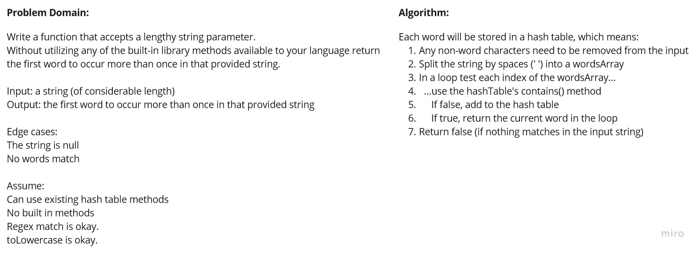

# Repeated Word

Write a function that accepts a lengthy string parameter.

Without utilizing any of the built-in library methods available to your language return the first word to occur more than once in that provided string.

## Challenge

**Create a function:**

>`repeatedWord(string)` (the `string` to search)  
>Input: a potentially lengthy `string` to search  
>Output: returns the first repeated word in the `string`
>Edge Case(s):
>- The string is null (returns false)
>- No words match (returns false)

## Approach & Efficiency

### Big O Notation

Time is O(n), space is O(n) as well since a new hashed table is created.

## Testing

Write tests to prove the following functionality:
*(Checked tests are required by the assignment however all tests are passing with 100% coverage)*

- [X] Returns the first word that is repeated in a string (Three values tested!)
- [X] Expects a null string to return false
- [X] Expects a string with no repeats to return false

## Whiteboard (Time-boxed, not representative of final code)

