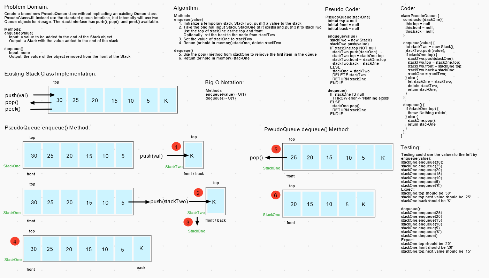

# Stacks and Queues

Write three classes, `Stack`, `Queue` and `Node`. The `Stack` class will have a `top` property, `Queue` will have a `front` property(1). The following methods can be called on the `Stack` and `Queue` classes.

## Challenge

**Stack should have these four different methods:**

>`.push(value)` (adds a node with `value` to the `top` of the stack)  
>Input: a `value` object to add to the stack's `top`  
>Output: none

>`.pop()` (remove the node at the `top` of the stack and return its `value`)  
>Input: none  
>Output: the `value` of the node removed from the `top` of the stack  
>Edge Case(s):
>- Attempting to `pop()` on an empty stack throws an exception

>`.peek()` (returns the `value` of the node at the `top` of the stack)  
>Input: none  
>Output: the `value` of the node at the `top` of the stack  
>Edge case(s):
>- Attempting to `peek()` on an empty stack throws an exception

>`.isEmpty()` (returns a boolean representing whether the stack is empty)  
>Input: none  
>Output: a boolean representing whether the stack is empty  

**Queue should have these four different methods:**

>`.enqueue(value)` (adds a node with `value` to the `end` of the queue)  
>Input: a `value` object to add to the queue's `end`  
>Output: none  

>`.dequeue()` (remove the node at the `front` of the queue and return its `value`)  
>Input: none  
>Output: the `value` of the node removed from the `front` of the queue  
>Edge Case(s):
>- Attempting to `dequeue()` on an empty queue throws an exception

>`.peek()` (returns the `value` of the node at the `front` of the queue)  
>Input: none  
>Output: the `value` of the node at the `front` of the queue  
>Edge case(s):
>- Attempting to `peek()` on an empty queue throws an exception

>`.isEmpty()` (returns a boolean representing whether the queue is empty)  
>Input: none  
>Output: a boolean representing whether the queue is empty  

**PseudoQueue should have these three different methods:**

>`.enqueue(value)` (adds a node with `value` to the `end` of the pseudoqueue)  
>Input: a `value` object to add to the pseudoqueue's `end`  
>Output: none  

>`.dequeue()` (remove the node at the `top` of the pseudoqueue and return its `value`)  
>Input: none  
>Output: the `value` of the node removed from the `top` of the pseudoqueue  
>Edge Case(s):
>- Attempting to `dequeue()` on an empty pseudoqueue throws an exception

>`.peek()` (returns the `value` of the node at the `top` of the pseudoqueue)  
>Input: none  
>Output: the `value` of the node at the `top` of the pseudoqueue  
>Edge case(s):
>- Attempting to `peek()` on an empty pseudoqueue throws an exception

## Approach & Efficiency

(1) I found that it was necessary to also add an `end` property to the `Queue` and `PseudoQueue` class to maintain O(1) time performance.

### Big O Notation

- All methods on all classes are O(1) for time and space.

## Testing

Write tests to prove the following functionality:

- Stacks
  - Can successfully push onto a stack
  - Can successfully push multiple values onto a stack
  - Can successfully pop off the stack
  - Can successfully empty a stack after multiple pops
  - Can successfully peek the next item on the stack
  - Can successfully instantiate an empty stack
  - Calling pop or peek on empty stack raises exception

- Queues
  - Can successfully enqueue into a queue
  - Can successfully enqueue multiple values into a queue
  - Can successfully dequeue out of a queue the expected value
  - Can successfully peek into a queue, seeing the expected value
  - Can successfully empty a queue after multiple dequeues
  - Can successfully instantiate an empty queue
  - Calling dequeue or peek on empty queue raises exception

- PseudoQueues
  - Can successfully enqueue a value onto a pseudoqueue
  - Can successfully enqueue multiple values onto a pseudoqueue
  - Can successfully dequeues out of a pseudoqueue the expected value
  - Can successfully empty a pseudoqueue after multiple dequeues
  - Can successfully peek the first item on the pseudoqueue
  - Can successfully instantiate an empty pseudoqueue
  - Calling dequeue or peek on empty pseudoqueue raises exception

## Whiteboard(s)

_Whiteboard(s) may not contain the final coded solution and are time-boxed._

