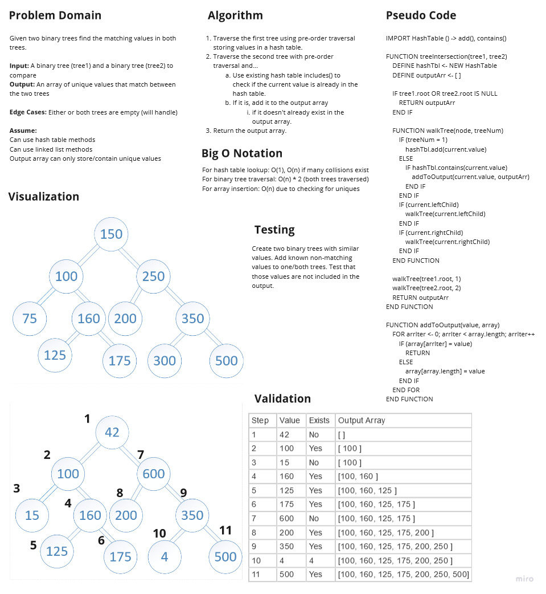

# Tree Intersection

Write a function called tree_intersection that takes two binary tree parameters.

Without utilizing any of the built-in library methods available to your language, return a set of values found in both trees.

## Challenge

**Create a function treeIntersection:**

>`treeIntersection(tree1, tree2)` (compares `tree1` and `tree2` and outputs an array of duplicate values)  
>Input: A binary tree `tree1` and a binary tree `tree2` to compare  
>Output: An `array` of unique values that match between the two trees  
>Edge Case(s):  
>- Either or both trees will be empty (will be handled)

## Approach & Efficiency

### Big O Notation

For hash table lookup: O(1), O(n) if many collisions exist

For binary tree traversal: O(n) * 2 (both trees traversed)

For array insertion: O(n) due to checking for uniques

## Testing

Write tests to prove the following functionality:

- [X] Successfully outputs the values that intersect in two binary trees
- [X] Successfully outputs an empty array if tree 1 is empty
- [X] Successfully outputs an empty array if tree 2 is empty

## Whiteboard/UML

_Whiteboard(s) may not contain the final coded solution and are time-boxed._

