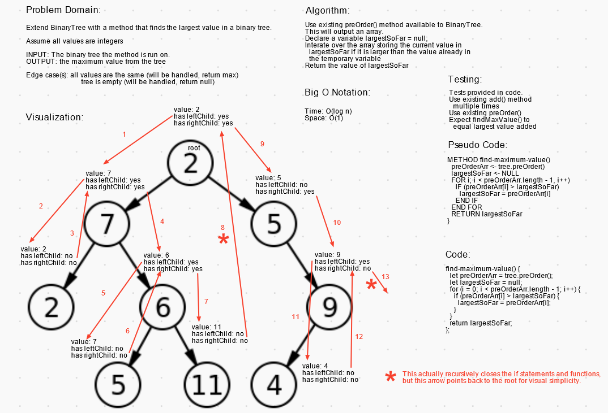

# Binary Search Trees

Create a Node class
- Create a Node class that has properties for the value stored in the node, the left child node, and the right child node.

Create a BinaryTree class

- Define a method for each of the depth first traversals called preOrder, inOrder, and postOrder which returns an array of the values, ordered appropriately. Also add findMaximumValue(arr) which find the maximum value in an array returned by the previous methods.

Create a BinarySearchTree class

- Define a method named add that accepts a value, and adds a new node with that value in the correct location in the binary search tree.
- Define a method named contains that accepts a value, and returns a boolean indicating whether or not the value is in the tree at least once.

## Authors

Authors: Jeremy Penning  
Co-Author: I proudly worked with Tahmina Ringer on this one.

## Challenge

**BinaryTree should have these four different methods:**

>`.preOrder()` ()  
>Input: the binary tree the method is called on  
>Output: array of values using preOrder sort

>`.inOrder()` ()  
>Input: the binary tree the method is called on  
>Output: array of values using preOrder sort

>`.postOrder()` ()  
>Input: the binary tree the method is called on  
>Output: array of values using inOrder sort

>`.findMaximumValue(arr)` (takes in an array returned by one of the methods above)  
>Input: an array returned by `preOrder()`, `inOrder()` or `postOrder()`  
>Output: an integer with the maximum value found in the tree

**BinarySearchTree should have these two different methods:**

>`.add(value)` (adds a node with `value` to the binary search tree)  
>Input: a `value` object to add to the binary tree at the proper location  
>Output: none  

>`.contains(value)` (searches for a `value` in the binary search tree)  
>Input: a `value` to search for in the tree  
>Output: a boolean representing whether or not the value is in the tree  

## Approach & Efficiency

### Big O Notation

- Binary search tree insertion and search is a worst case of O(log n) on a balanced tree, or on an unbalanced tree it is O(height). Space should be Big O(1) for search.

## Testing

Write tests to prove the following functionality:
- Can successfully instantiate a new node
- Can successfully instantiate an empty Binary Search Tree
- Can successfully instantiate a tree with a single root node
- Can successfully add a left child and right child to a single root node
- Can successfully returns null on BinaryTree methods if called on an empty tree
- Can successfully return a collection from a preorder traversal
- Can successfully return a collection from an inorder traversal
- Can successfully return a collection from a postorder traversal
- Can successfully return the correct maximum value from the tree
- Can successfully returns true when running contains() on good value
- Can successfully returns false when running contains() on bad value

## Whiteboard(s) / UML

_Whiteboard(s) may not contain the final coded solution and are time-boxed._

